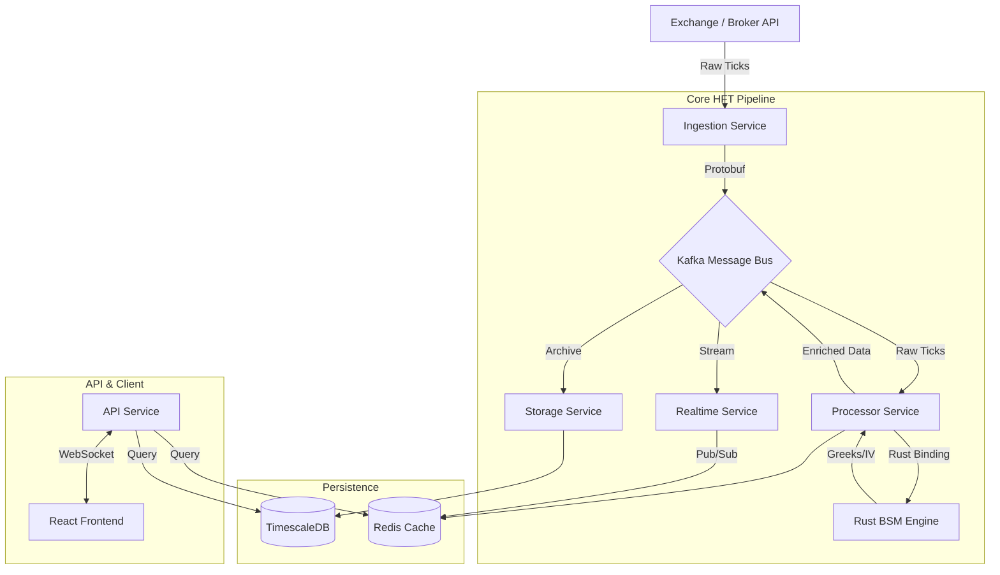

# Stockify — High-Frequency Trading (HFT) Engine

**A sub-millisecond, event-driven trading platform engineered for real-time market analysis and execution.**


---

## 📖 Introduction: What is this project?

**Stockify** is a production-grade High-Frequency Trading (HFT) engine designed to solve the problem of **market data latency** and **complex real-time analytics**. In financial markets, milliseconds matter. Traditional systems often struggle to process thousands of price updates per second (ticks), calculate complex derivatives (Greeks), and serve them to traders without lag.

This project demonstrates a complete, end-to-end solution that:
1.  **Ingests** massive market data streams via customized connectors.
2.  **Processes** data using a hybrid **Python + Rust** engine for maximum speed.
3.  **Analyzes** market structure using advanced algorithms (Gamma Exposure, VIX Divergence).
4.  **Delivers** zero-latency updates to a Reactive Web UI.

It is built to showcase **system design mastery**, **scalability**, and **quantitative finance expertise**.

---

## ✨ Key Features

### For the Trader (User Experience)
*   **⚡ Real-Time Option Chain**: Live updates of Call/Put prices, Open Interest (OI), and Implied Volatility (IV) streaming via WebSockets.
*   **🛡 Risk Analysis**: Real-time calculation of Option Greeks (Delta, Gamma, Theta, Vega) using a custom **Rust BSM Engine**.
*   **📊 Algo-Driven Insights**:
    *   **Buildup Analysis Pro**: Detects Long Buildup, Short Covering, etc., using a weighted multi-factor scoring model.
    *   **Gamma Exposure (GEX)**: Visualizes "Gamma Walls" where dealers are hedging, identifying potential support/resistance.
    *   **VIX Divergence**: Alerts when Option Prices diverge from the expected volatility index.
*   **🏎 Sub-Millisecond Latency**: Optimized pipeline ensures "tick-to-trade" speed is minimized.

### For the Engineer (Technical Highlights)
*   **Hybrid Compute Engine**: Critical mathematical operations (Black-Scholes-Merton) are offloaded to **Rust** via PyO3 for 100x performance vs pure Python.
*   **Event-Driven Architecture**: Fully decoupled microservices communicating via **Apache Kafka** with strictly typed Pydantic schemas.
*   **High-Performance Storage**: Uses **TimescaleDB** (PostgreSQL extension) for time-series data and **Redis Cluster** for hot cache/PubSub.
*   **Scalable Backend**: Built with **FastAPI** (Python 3.11) utilizing full AsyncIO.
*   **Kubernetes Ready**: Includes full K8s manifests and Helm charts for production deployment.

---

## 🔄 System Architecture & Data Flow

How does a price tick travel from the stock exchange to the user's screen?



### The "Story of a Tick" (End-to-End Flow)
1.  **Ingestion**: The `ingestion-service` connects to the Broker WebSocket. It receives a raw binary/JSON packet. It standardizes this into a `MarketRawMessage` (Pydantic) and pushes it to the `market.raw` Kafka topic.
2.  **Processing**: The `processor-service` consumes the message.
    *   It identifies the logic needed (e.g., Option Pricing).
    *   It calls the **Rust BSM Engine** (`bsm_engine`) to calculate Delta, Theta, Gamma, and Vega in nanoseconds.
    *   It calculates **Implied Volatility (IV)** using a Newton-Raphson solver.
    *   It packages the result into a `MarketEnrichedMessage` and publishes to `market.enriched`.
3.  **Broadcasting**: The `realtime-service` subscribes to `market.enriched`. It immediately pushes the update to **Redis Pub/Sub** channels (e.g., `ticks:NIFTY`).
4.  **Delivery**: The **FastAPI Backend** (`ocd-backend`) holds open WebSocket connections. When Redis signals an update, FastAPI forwards it to the specific connected client.
5.  **Visualization**: The **React Frontend** receives the JSON payload. The Virtual DOM updates only the changed cell (e.g., Strike 25000 CE Price), causing a localized green/red flash.

---

## 🧠 Algorithmic Logic (Deep Dive)

### 1. Rust BSM Engine (`rust_modules/bsm_engine`)
Calculating Greeks for 500+ option strikes every second is CPU intensive. We use a custom Rust module bound to Python via PyO3.
*   **Method**: Black-Scholes-Merton Model.
*   **Optimization**: Uses the Abramowitz and Stegun approximation for the Cumulative Normal Distribution Function (CDF), achieving a max error of `1.5e-7` while being significantly faster than standard `scipy.stats`.

### 2. Multi-Factor Buildup Scoring (`BuildupAnalysisPro`)
How do we know if "Institutions are buying"? We don't guess. We score every strike based on:
*   **OI Change Z-Score (20%)**: Is the change statistically significant (>2 standard deviations)?
*   **Premium Flow (15%)**: Is money entering or leaving the contract?
*   **Delta Magnitude (12%)**: How sensitive is this option to price moves?
*   **Volume/OI Ratio**: Is this speculation or hedging?
*   **Gamma Exposure**: Is this a dealer hedging wall?

### 3. Gamma Exposure (GEX)
We calculate the Dealer's total hedging requirement across the entire chain.
*   **Positive GEX**: Dealers effectively "buy low, sell high" to hedge, stabilizing the market (Range-bound).
*   **Negative GEX**: Dealers must "sell low, buy high", accelerating moves (Explosive/Crash risk).

---

## 🛠 Technology Stack & Decisions

| Technology | Role | Why we chose it? |
| :--- | :--- | :--- |
| **FastAPI** | Backend API | Native AsyncIO support handles 10k+ concurrent WebSocket connections efficiently. |
| **Rust (PyO3)** | Compute | Python is too slow for iterating over 1000s of contracts for Greek algo-math alone. Rust provides bare-metal performance. |
| **Apache Kafka** | Message Bus | Decouples Ingestion from Processing. Ensures a crash in the DB layer doesn't stop market feeds. |
| **TimescaleDB** | Database | Relational (SQL) power but optimized for time-series. Data is partitioned by time chunks/hyper-tables. |
| **Redis Cluster** | Cache/PubSub | Distributed memory store for "Hot" data. Essential for the real-time feedback loop. |
| **Pydantic** | Validation | Ensures strict type safety across the entire pipeline. If a field is missing, the system fails fast. |
| **Docker & K8s** | Infra | Containerization ensures consistent environments from Dev to Prod. Helm charts provided for scaling. |

---

## 📂 Project Modules

A structured breakdown of the codebase:

```text
/
├── core/                   # THE SHARED BRAIN
│   ├── models/             # Pydantic Schemas (MarketSnapshot, OptionContract)
│   ├── utils/              # Logging, Config, DateTime helpers
│   └── database/           # SQLAlchemy Async Sessions
│
├── services/               # MICROSERVICES
│   ├── ingestion/          # Connects to Dhan/Zerodha APIs
│   ├── processor/          # Master Orchestrator (Calls Rust Engine)
│   │   └── analyzers/      # GEX, VIX, Buildup logic lives here
│   ├── calculations/       # Pure Python math fallbacks (IV Solver)
│   ├── storage/            # Writes to TimescaleDB asynchronously
│   ├── realtime/           # Redis Pub/Sub integration
│   ├── ocd-backend/        # User-facing API (Auth, Profiles)
│   └── ocd-frontend/       # React/Vite Trading Terminal
│
├── rust_modules/           # PERFORMANCE LAYERS
│   └── bsm_engine/         # The Rust crate for Greeks
│
├── k8s/                    # DEPLOYMENT
│   ├── base/               # Kustomize base configs
│   └── helm/               # Helm charts
│
└── docker-compose.yml      # Local dev orchestration
```

---

## 🚀 Getting Started

### Prerequisites
*   **Docker Desktop** (Engine 20.10+)
*   **Git**

### Installation

1.  **Clone the Repository**
    ```bash
    git clone https://github.com/DeepStacker/fastapi-hft-engine.git
    cd fastapi-hft-engine
    ```

2.  **Configure Environment**
    Copy the example config and add your Broker keys (if you have them, otherwise mock data simulates a feed).
    ```bash
    cp .env.example .env
    ```

3.  **Launch System**
    We use a `Makefile` to simplify Docker Compose commands.
    ```bash
    make up
    ```

4.  **Initialize Database**
    Sets up the Hyper-tables in TimescaleDB.
    ```bash
    make init-db
    ```

### Accessing the Dashboard
*   **Trading Terminal**: [http://localhost:5173](http://localhost:5173)
*   **API Docs**: [http://localhost:8000/docs](http://localhost:8000/docs)
*   **Grafana Monitor**: [http://localhost:3001](http://localhost:3001)

---

## 👨‍� Developer Reference

| Command | Description |
| :--- | :--- |
| `make up` | Start full stack (Detached) |
| `make down` | Stop full stack |
| `make logs` | Tail logs of all services |
| `make migrate-up` | Run Alembic DB migrations |
| `make test` | Run PyTest suite |

---

**Built with ❤️ for High Performance Computing.**
