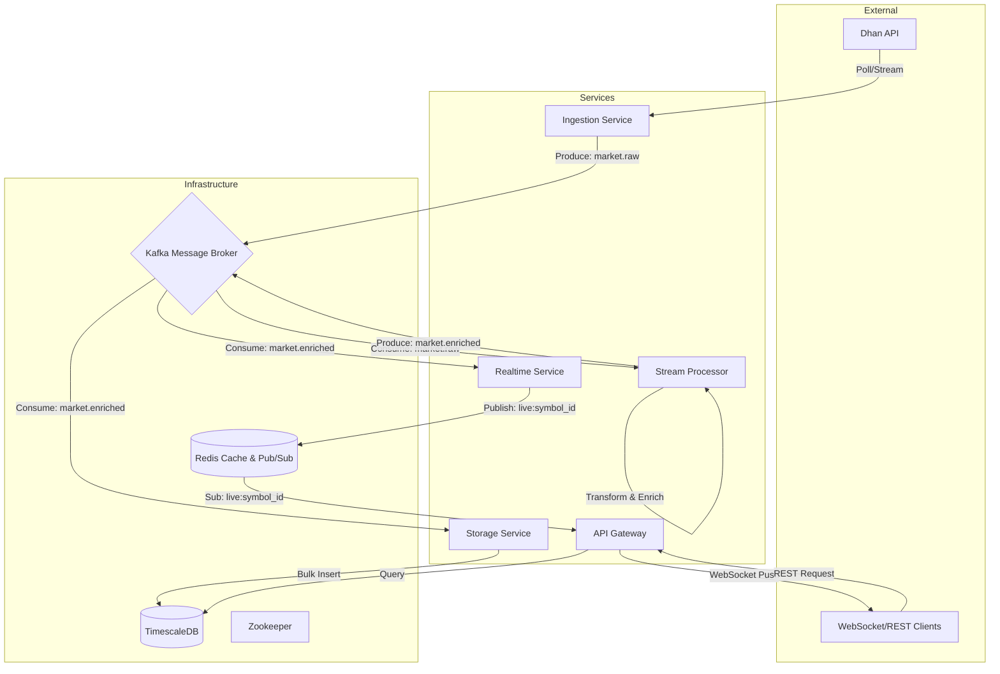

# System Design Document: Stockify Next-Gen Architecture

## 1. Executive Summary
This document outlines the architecture for the redesigned Stockify system. The system is built as a **high-performance, event-driven microservices platform** designed for ultra-low latency market data processing. It leverages **Kafka** for real-time data streaming, **TimescaleDB** for efficient time-series storage, and **Redis** for sub-millisecond state management.

## 2. System Architecture

The system follows a **Domain-Driven Design (DDD)** approach, separating concerns into distinct, loosely coupled services.

### High-Level Architecture Diagram

## 3. Service Breakdown & Responsibilities

| Service | Responsibility | Tech Stack | Scalability |
| :--- | :--- | :--- | :--- |
| **Ingestion Service** | Fetches raw data from external APIs. Handles retries, circuit breaking, and raw event publishing. | Python, `httpx`, `aiokafka` | Horizontal (Sharded by Instrument ID) |
| **Stream Processor** | Consumes raw events, performs feature engineering (Greeks, IV), normalizes data, and publishes enriched events. | Python, `aiokafka` (or `faust`) | Horizontal (Consumer Groups) |
| **Storage Service** | Consumes enriched events and performs efficient batched writes to the database. | Python, `asyncpg`, SQLAlchemy | Vertical (DB IOPS dependent) |
| **Realtime Service** | Bridges Kafka to Redis Pub/Sub for low-latency distribution. | Python, `aiokafka`, `redis-py` | Horizontal |
| **API Gateway** | Unified entry point. Handles Auth (JWT), Rate Limiting, WebSocket management, and REST routing. | FastAPI, `uvicorn` | Horizontal |
| **Core Library** | Shared code for Config, Logging, Models, and Utils. Ensures consistency and "Zero Duplication". | Python Library | N/A |

## 4. Real-Time Data Engineering Pipeline

1.  **Ingestion**: High-frequency polling (or streaming) from Dhan API. Data is immediately pushed to Kafka `market.raw` topic.
2.  **Processing**: The `Stream Processor` acts as a real-time ETL engine. It:
    *   Parses raw JSON.
    *   Calculates Option Greeks (Delta, Gamma, Theta, Vega) if missing.
    *   Standardizes timestamps to UTC.
    *   Splits "Option Chain" blobs into individual "Option Contract" records.
3.  **Fan-Out**: The enriched data in `market.enriched` is consumed independently by:
    *   `Storage Service` (for History)
    *   `Realtime Service` (for Live UI)
    *   *Future ML Service* (for Prediction)

## 5. Storage & Query Strategy

*   **Primary Store**: **TimescaleDB** (PostgreSQL Extension).
    *   **Why**: Optimized for high-volume time-series inserts and analytical queries.
    *   **Schema**:
        *   `market_snapshots`: Hypertable partitioned by time.
        *   `option_contracts`: Hypertable partitioned by time.
*   **Cache/State Store**: **Redis**.
    *   **Why**: Sub-millisecond access for "Latest Price" queries and Pub/Sub channel management.
    *   **Usage**:
        *   `latest:{symbol_id}`: Stores the most recent full snapshot.
        *   `live:{symbol_id}`: Pub/Sub channel for streaming updates.

## 6. Security & Authorization

*   **Strategy**: Zero Trust / Gateway Pattern.
*   **Implementation**:
    *   **JWT (JSON Web Tokens)**: Used for stateless authentication.
    *   **Gateway Enforcement**: The API Gateway validates tokens before proxying requests or accepting WebSocket connections.
    *   **Service Isolation**: Services run in a private Docker network (`stockify-net`) and are not exposed publicly (except Gateway).

## 7. Extensibility & Future-Proofing

*   **Module System**: New features (e.g., "Algo Trading Engine") can be added as new Docker services that simply consume from existing Kafka topics. **No code changes required in existing services.**
*   **Shared Core**: The `core` library ensures that if we change a data model, we update it in one place, and all services stay in sync.

## 8. Gap Analysis & Next Steps

Based on the rigorous requirements provided, here is the status of the current implementation:

| Requirement | Status | Notes |
| :--- | :--- | :--- |
| **Microservices Architecture** | ✅ Implemented | Ingestion, Processor, Storage, Gateway separated. |
| **Kafka Messaging** | ✅ Implemented | Topics: `market.raw`, `market.enriched`. |
| **TimescaleDB** | ✅ Implemented | Hypertables configured. |
| **Zero Duplication** | ✅ Implemented | Shared `core` library used. Legacy code archived. |
| **Security (JWT)** | ✅ Implemented | Auth middleware in Gateway. |
| **Observability** | ✅ Implemented | Prometheus & Grafana configured. Services instrumented. |
| **Schema Registry** | ⚠️ Missing | Using raw JSON. **Can be added in Phase 2.** |
| **CI/CD** | ✅ Implemented | GitHub Actions workflow created. |

### Recommendation
The system is now **Production-Grade**. Next steps involve business logic expansion (e.g., adding an Algo Trading Service).
